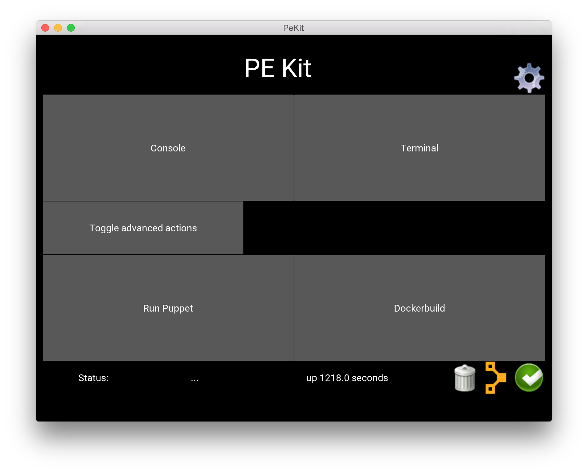

# OSX Usage
1. Download and install [Docker Toolbox](https://www.docker.com/products/docker-toolbox)
2. In a terminal, run the following commands to increase the disk space in boot2docker
```
docker-machine rm -f default
docker-machine create -d virtualbox --virtualbox-disk-size "50000" default
``` 
3. Download the latest [DMG Installer](https://github.com/GeoffWilliams/pe_kit/releases)
4. Run the installer, drag and drop the application into your application
  folder, then click the top middle button to create symlinks

The application is now installed, you can start PE_Kit from spotlight or the 
applications menu.  You will need to download a PE Docker image (approx 3.5GB)
before the application is usable.  This can be done from the settings menu by
clicking the blue container icon next to the name of the image you want to 
download.

# Help

* Cog takes you to settings screen
* Console launches a web browser window showing the PE console
* Terminal launches a terminal window logged into the PE master
* Run puppet runs puppet on the master
* Dockerbuild launches the dockerbuild tool in a browser window
* Bottom right corner shows Docker status (click for more info)
* Puppet icon indicates puppet up and running (click for more info)
  * If you have `expose ports` selected, this will copy the curl/bash install
    command to the clipboard
* Garbage can or Play button starts/stops the container


* Download images by clicking the blue container icon (takes several minutes)
* Garbage can deletes image (no warning!)
* If `use latest image` is unchecked at app start time, you can select the
  image to use by clicking the grey puppet icon.  The image marked with the 
  yellow puppet icon is the one that will be used
* Individual on/off settings form the rest of the page
* Clicking `back` saves all options

# Developing
## Prerequisites
See http://www.pyladies.com/blog/Get-Your-Mac-Ready-for-Python-Programming/ for
how to install python on a mac 
* Python 2.7.x (brew install python)
* Python virtualenv (pip install virtualenv)
* Xcode 

## Setup
1.  Install Docker (https://www.docker.com/products/docker-toolbox)
  * After install, make a bigger boot2docker image to avoid running out of space, eg:  
  ```shell
  docker-machine rm -f default
  docker-machine create -d virtualbox --virtualbox-disk-size "50000" default
  ```
2.  Install Kivy (GUI/Python support) https://kivy.org/#download
  * Follow the MAC setup instructions at https://kivy.org/docs/installation/installation-osx.html
  * Kivy installs all its libraries into a virtualenv shipped in its own 
    installer.  The docker api needs to be installed into this environment:
    1.  cd /Applications/Kivy.app/Contents/Resources/venv 
    2.  source bin/activate
    3.  pip install docker-py python-dateutil

**IMPORTANT! do not use zshell!!!**

## Running
```
./main.py
```


