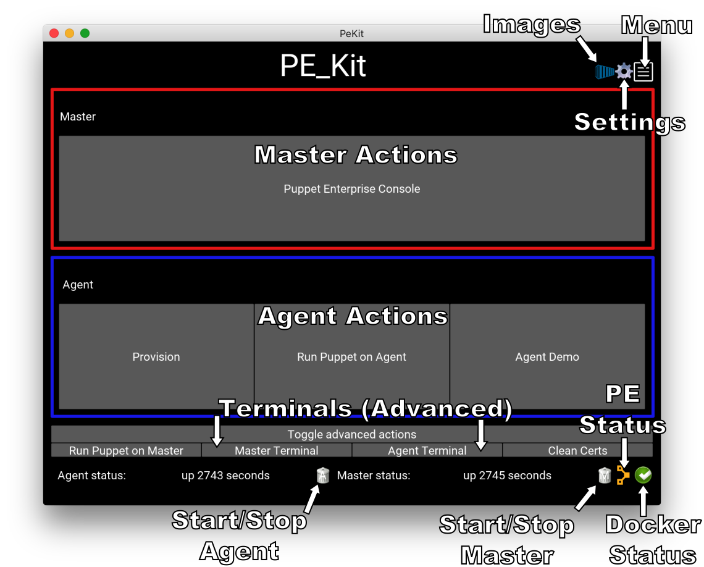

# PE_Kit
PE_Kit is a cross-platform (Linux and OSX) tool for demonstrating Puppet Enterprise _quickly_ and with the minimal amount of technical knowledge possible.


## Documentation
* [Installation](doc/install.md)
* [Help/Usage](doc/help.md)
* [Developing](doc/develop.md)


## FAQ
Q: How did this get written?

A: PE_Kit started as a 2-day experiment at work, development continued over several evenings and weekends... because I thought it was a cool project and enjoyed working on it

Q: What technologies are used?

A: PE_Kit uses a combination of Python, Docker, Kivy and pre-installed Puppet Enterprise DockerHub images

Q: Can you write support for XYZ feature?

A: By all means open a ticket on the [Issue Tracker](https://github.com/GeoffWilliams/pe_kit/issues).  Since PE_Kit is developed in my spare time and pretty much does what I want it to now, I can't commit to adding new features so feel free to send a Pull Request.

Q: I found a bug!

A: Please report it on the [Issue Tracker](https://github.com/GeoffWilliams/pe_kit/issues).  To make troubleshooting easy, please include the details of how to reproduce the error and include the log messages from around the time the bug occurred.  Log messages can be obtained by starting PE_Kit in a terminal and copying the relevant text or by clicking the `Copy log messages to clipboard` button on the menu screen.

Q: What is the support status of PE_Kit/Why wasn't my bug fixed?!

A: This project is **not supported** by Puppet Inc., although it works great for me.  I'm developing it because I find it a useful tool but I have very little spare time and can't commit to any timeframe for fixing bugs that come up.

Q: Can I send you a Pull Request?

A: Sure!  Please work on a feature branch and prepare your GitHub Pull Request in the usual way :)

Q: Why are the images so huge?!

A: The images include an unpacked copy of the Puppet Enterprise installation media, agent software for all supported Puppet open-source agents and various other cool stuff, so yes they are somewhat large.

Q: Where is the image for version XYZ of Puppet Enterprise?

A: Images are created using my [puppet docker image build script](https://github.com/GeoffWilliams/puppet_docker_images) and are then uploaded to the DockerHub.  I don't always get a chance to build and upload every image as this process takes a couple of hours and needs a fast internet connection (I need to be in the office).  If you urgently need an image, you could try building it yourself and tagging it with my dockerhub prefix `geoffwilliams/pe_master_public_lowmem_r10k_dockerbuild`

Q: What do the crazy PE Master image tags mean?

A: PE Master images are tagged `PE_VERSION`-`BUILD`, eg `2016.1.2-2` refers to my second attempt at building PE 2016.1.2

Q: Why didn't you use Ruby?  You suck!

A: I spent a good hour looking for a Ruby UI toolkit I liked and then gave up and used Kivy

Q: Python's too hard!

A: Take a teaspoon of concrete and harden up :P

Q: What's this Kivy thing?

A: [Kivy](https://kivy.org/) is a modern, touch enabled GUI with great cross-platform support, allowing application developed with it to run on a range of devices including PC, Android and IOS

Q: Why does the GUI look so damn weird?

A: Kivy defaults to a black, grey and blue colour scheme which I think looks kinda cutting-edge and cool although others may disagree with me.  It is apparently possible to [change the colours](http://www.it-digin.com/blog/?p=216) or create your own artwork but this isn't something that I was interested in doing.

Q: Internet doesn't work inside any of the containers I booted (I'm using a MAC)?

A: Short answer:
```Shell
docker-machine restart
```
Longer answer:  You'r probably hitting this [bug](https://github.com/boot2docker/boot2docker/issues/776) in boot2docker where changing wifi/networks on the main laptop doesn't change your DNS settings in `/etc/resolv.conf` within the boot2docker VM.  Alternatively you may have altered the DNS server to use in `/var/lib/boot2docker/profile` inside the boot2docker machine.  If so, make sure any DNS servers specified are reachable.  That said, the agent and master are supposed to work without any internet connectivity, if you find this is not the case, please open a bug against PE_Kit.
