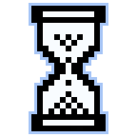
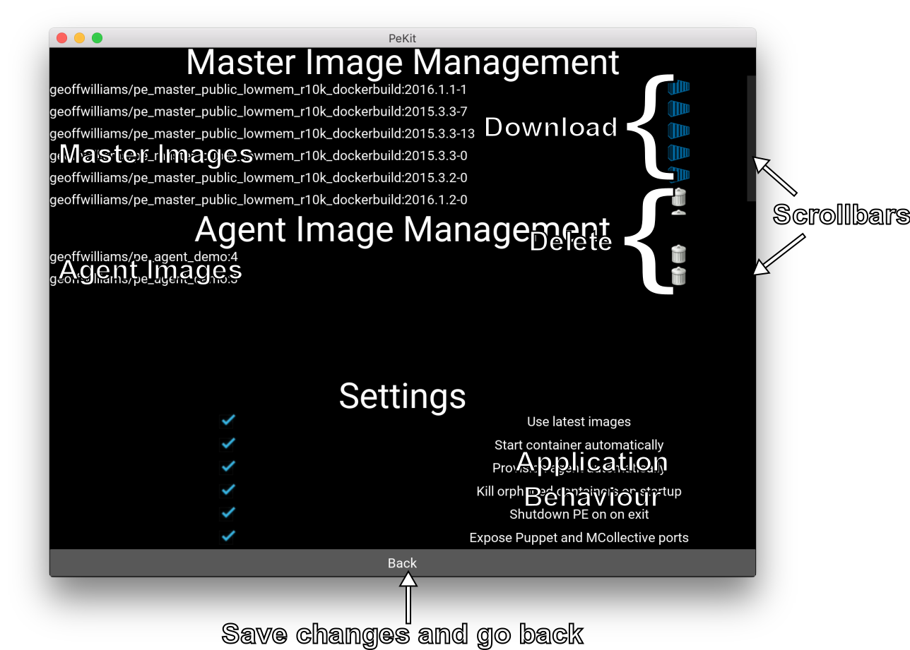
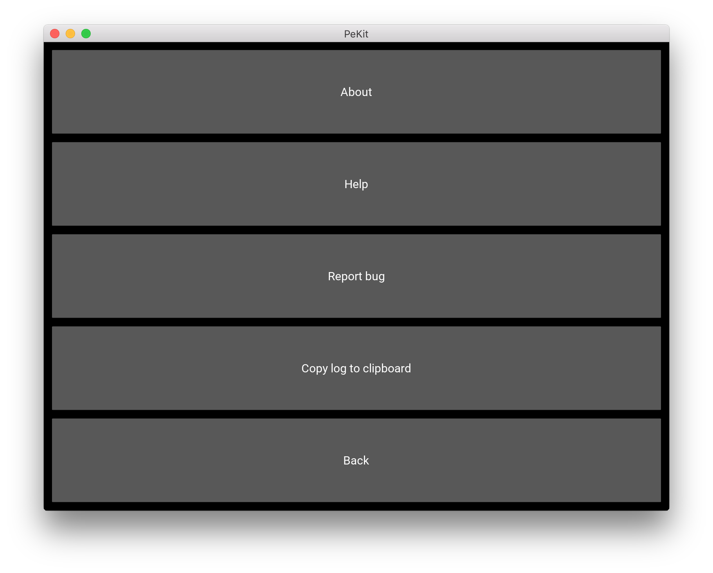

# PE_Kit Help

## Quickstart
1. Click `Settings`
2. Slect one image each from the Master Image Management and Agent Image Management lists and click  to download them.  This will take several minutes as the images are serveral gigabytes in size.  If you like, you can skip this step and use the [docker pull]( https://docs.docker.com/engine/reference/commandline/pull/) command instead.
3. Close PE_Kit by clicking the window's close button
4. Start PE_Kit again.  With the default settings, this will start both the Master and Agent containers
5. As the system loads, buttons will start to be enabled for the Master (red box) and the Agent (blue box).   This takes approximately two minutes to complete and by the end there should be a Puppet logo in towards the bottom right of the screen.
6. With the  icon displayed, click `Puppet Enterprise Console` and your system web browser will open and navigate to the URL where the console is running
7. Click through the warning from your browser and login to the console:
    * Username: `admin`
    * Password: `aaaaaaaa` (eight a's)
8. When you have finished using Puppet Enterprise, click the window's close button to completely shutdown and destroy the Master and Agent.  At this point, all changes made will be lost.  Next time you run PE_Kit, a fresh Master and Agent will be created.

## Main Screen
The main screen gives the status of the Docker daemon and lets you start/stop containers.  As containers become active, the GUI will progressively enable more actions as different parts of the system become available.

On startup, the PE_Kit will check to see if a new version of PE_Kit has been released.  You should always make sure your running the latest version of PE_Kit before reporting bugs.

### Docker daemon status
The bottom right corner of the main screen displays the current docker status.  The icon can be clicked to provided detailed information.  On OSX, PE_Kit will attempt to start boot2docker using the `docker-machine` command if it is not detected running.
| Icon | Description |
| ---- | ----------- |
|  | Docker is working |
|  | Docker is starting |
|  | Error talking to Docker |
The  needs to be present at all times for any actions in the GUI to be effective.

### PE status
The GUI will periodically attempt to poll the PE console to check on its health.  This is communicated back to the user by displaying an icon towards the bottom right corner of the main screen.  The icon can be clicked to provide detailed information.
| Icon | Description |
| ---- | ----------- |
|  | The Master container is not running |
|  | PE is loading (takes about 2 minutes) |
|  | PE console is available (click to copy curl command) |

### Starting and stopping containers
If `Start containers automatically` is ticked, a Master and Agent container will be started for you when PE_Kit starts.  The GUI will display an icon for both containers to indicate whether each one is running or not.
| Icon | Description |
| ---- | ----------- |
|  | Container isn't running, click to start |
|  | Container is running, click to stop[1](#footnote1) |

The icon for each container is overlayed with an 'A' for Agent or an 'M' for Master so that the user can tell which button is which.

If you would like to stop a container, click  and it will be stopped immediately.  You can restart the container by clicking .

Note that if `Start containers automatically` is not ticked, you must start the containers you want to use manually by clicking .

<a name="footnote1">1</a>: Destroying a container permanently deletes any data stored in it.  A fresh system will be created for you next time you click the start container button.

## Settings Screen
The settings screen allows the user to easily manage images and configure PE_Kit and is accessed by clicking  on the main screen.  

New versions of Puppet Enterprise need to be made available on DockerHub before they can be used.  PE_Kit checks for new images on startup and alerts the user if new images exist.  These can then be downloaded by clicking .

### Managing images
When PE_Kit starts, it will build a combined list of all available local and remote images for the Master and Agent.  The lists will be drawn with scrollbars if they are long enough to need them.  One of the following icons will be displayed for each image:

| Status | Icon | Description |
| ------ | ---- | ----------- |
| Available |  | Image downloaded and available for use, click to delete|
| Downloadable |  | Image avaiable on Docker Hub, click to download |
| Downloading |  | Image is currently downloading, click to stop |

If `Use latest images` is deselected, an additional icon will appear next to _local_ images 
| Icon | Description |
| ---- | ----------- |
|  | Use this image |
|  | Do not use this image |
You must then select one image from each group to use for the Master and Agent.  Your selection will be activated when you click `back`.

### Program behaviour
You can alter PE_Kit behaviour by clicking the checkbox to the left of the description (it seems invisible on OSX) 
| Setting | Description |
| ------- | ----------- |
| Use latest images | Use the latest (by version number) available image for the Master and Agent |
| Start containers automatically | Start the Master and Agent containers automatically on load |
| Provision agent automatically | Fully provision the agent automatically (Only available when `Start containers automatically` is ticked) |
| Kill orphaned containers on startup | Attempt to kill any orphaned Master/Agent containers on startup.  Useful if PE_Kit was killed |
| Shutdown containers on on exit | Stop the Master and Agent containers when exiting |
| Expose Puppet and MCollective ports | Map ports to the local machine/boot2docker to allow other systems to connect to Puppet |

## Menu Screen
The menu screen is accessed by clicking  on the main screen.

| Button | Description |
| ------ | ----------- |
| About | Display version and license information |
| Help | Open this page in the system web browser |
| Report bug | Open the new issue page in the system web browser |
| Copy log to clipboard | Copy the log to clipboard so it can be pasted into a bug report |
| Back | Return to main screen |

## Configuration file
PE_Kit settings are saved to the file `.pe_kit.cfg` in the current user's home directory.  While most of the important settings are managed by the settings screen, the following extra settings are available for customisation by expert users:

| Setting | Type | Description |
| ------- | ----- | ----------- |
| gh_repo | string | URL of upstream GitHub project, used to build URLs internally |
| master_image | string | Name of DockerHub image (excluding tag) to use for the Master |
| agent_image | string | Name of DockerHub image (excluding tag) to use for the Agent |
| terminal_program | string | Program to run when a terminal is needed.  Blank for system default |
